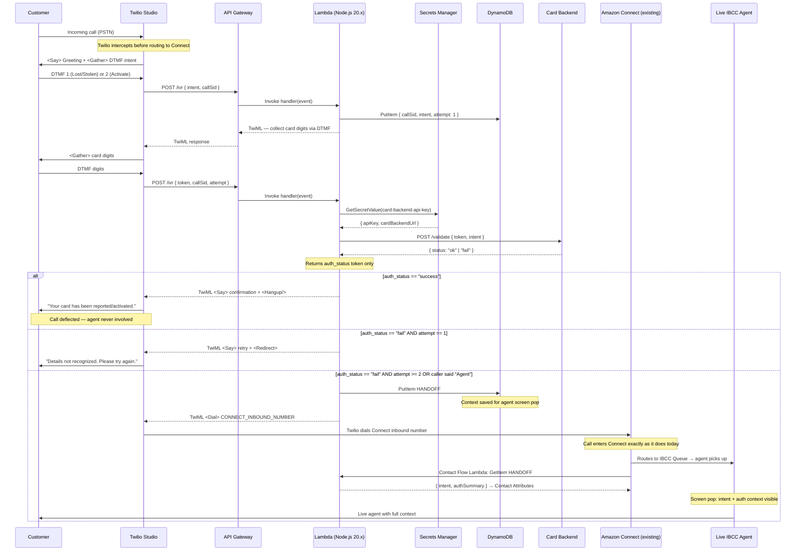

# IVR Flow — Sequence Diagram

## Current State (Before This Project)
```
Customer → Twilio (PSTN inbound) → Amazon Connect → IBCC Queue → Live Agent
```
Every call reaches a live agent. No self-service. No call deflection.

---

## New Flow (With AI IVR Layer)



## What Changes vs. Today

| | Before | After |
|---|---|---|
| Every call → agent | ✅ | ❌ (self-service first) |
| Call deflection rate | 0% | ~60–70% (self-service success) |
| Warm handoff path | Twilio → Connect (direct) | Twilio → IVR → Connect (same endpoint) |
| Agent has call context | ❌ | ✅ (screen pop via DynamoDB) |
| PII in logs | Risk | Zero (redacted before logging) |

## Data Redaction Policy

| Field       | Collected Via      | Logged  | Passed to LLM     |
|-------------|-------------------|---------|-------------------|
| Card Number | DTMF / Twilio Pay | NEVER   | NEVER             |
| CVV         | DTMF / Twilio Pay | NEVER   | NEVER             |
| Caller Phone| Twilio header     | YES     | HANDOFF key only  |
| Auth Result | Lambda token      | NEVER   | `auth_status` only|
| Call SID    | Twilio header     | YES     | YES               |
| Intent      | DTMF digit        | YES     | YES               |
